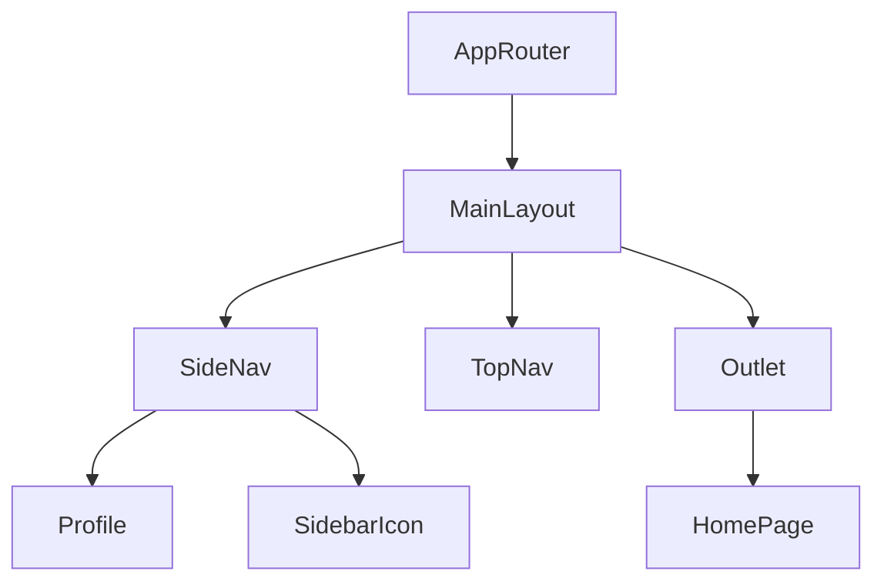

# Layout & Navigation 설계 문서 (Retroactive)

## 1. 개요
- **기능명**: layout-navigation
- **계획서**: [plan.md](../../01-plan/features/layout-navigation.plan.md)
- **작성일**: 2026-01-30 (Retroactive)
- **작성자**: WooriDo Agent (Antigravity)

## 2. 아키텍처

### 2.1 시스템 구조

### 2.2 컴포넌트 설계
| 컴포넌트 | 역할 | 기술 |
|----------|------|------|
| `MainLayout` | 전체 레이아웃 구조 제어 (사이드바 토글, 모바일 드로어 상태 관리) | React, CSS Modules (Grid/Flex) |
| `SideNav` | 네비게이션 메뉴 및 프로필/로그아웃 기능 제공 | `NavLink`, `Profile`, `SidebarIcon` |
| `TopNav` | 상단 검색바 및 사용자 인증 상태 표시 | `SearchIcon` (Custom SVG) |
| `Profile` | 사용자 아바타 및 정보 표시 (Lottie 로딩 포함) | `lottie-react` |
| `Icons` | 이모지를 대체하는 커스텀 SVG 아이콘 시스템 | SVG Paths, `currentColor` |

## 3. API 설계 (Frontend Focus)

### 3.1 상태 관리 (State Management)
* **Auth State**: `MainLayout`에서 관리되는 `isLoggedIn`, `user` 객체를 `Outlet context`를 통해 하위 페이지(`HomePage`)로 전달.
* **UI State**: `isSidebarCollapsed` (데스크탑), `isMobileMenuOpen` (모바일) 상태를 `MainLayout`에서 `useState`로 관리.

## 4. 데이터베이스 설계
* 본 기능 개선으로 인한 DB 스키마 변경 사항 없음.

## 5. 프론트엔드 설계

### 5.1 화면 구성
| 화면 | 경로 | 컴포넌트 | 설명 |
|------|------|----------|------|
| 메인 레이아웃 | `/` (Layout) | `MainLayout.tsx` | 좌측/상단 고정, 컨텐츠 영역 스크롤 |
| 사이드바 | (In Layout) | `SideNav.tsx` | 280px (Open) / 80px (Collapsed), 모바일은 Overlay |
| 홈 페이지 | `/` (Index) | `HomePage.tsx` | 카테고리(원형), 내 챌린지, 추천 챌린지 섹션 |

### 5.2 WDS 컴포넌트 사용
- [x] Button (Login/Signup/Logout)
- [x] Profile (New Component)
- [x] Lottie Animation (Profile Loading)
- [x] Icons (SidebarIcon, SearchIcon, CategoryIcon)

### 5.3 아이콘 시스템 (`SidebarIcon`)
* `type` prop을 받아 해당하는 SVG Path를 렌더링.
* `size` prop으로 크기 제어 (Default: 20px).
* `SideNav` 메뉴 아이템과 1:1 매핑.

### 5.4 프로필 컴포넌트 (`Profile`)
* **Responsive**: `size` props (xs, sm, md, lg, xl) 지원.
* **Loading**: `isLoading` prop이 true일 때 `babel-badge.json` Lottie 애니메이션 재생.
* **Fallback**: 이미지 로드 실패 시 이니셜 표시.

## 6. WooriDo 도메인 규칙 적용

### 6.1 당도(Brix) 시스템
* 프로필 컴포넌트 확장 시 당도 점수 뱃지 표시 가능 (현재는 기본 구조만 구현).

### 6.2 Fintech 규칙
* 해당 없음.

## 7. 테스트 계획 (Verification)
- [x] 단위 테스트: `SideNav` 메뉴 렌더링 및 링크 이동 확인.
- [x] 스타일 테스트: 모바일 화면(<768px)에서 햄버거 메뉴 동작 및 오버레이 확인.
- [x] 통합 테스트: 로그인 상태 변경 시 `TopNav`, `SideNav`, `HomePage` UI 즉시 반영 확인.

## 8. 다음 단계
- [ ] `/pdca-check layout-navigation` 실행 (Gap Analysis)
