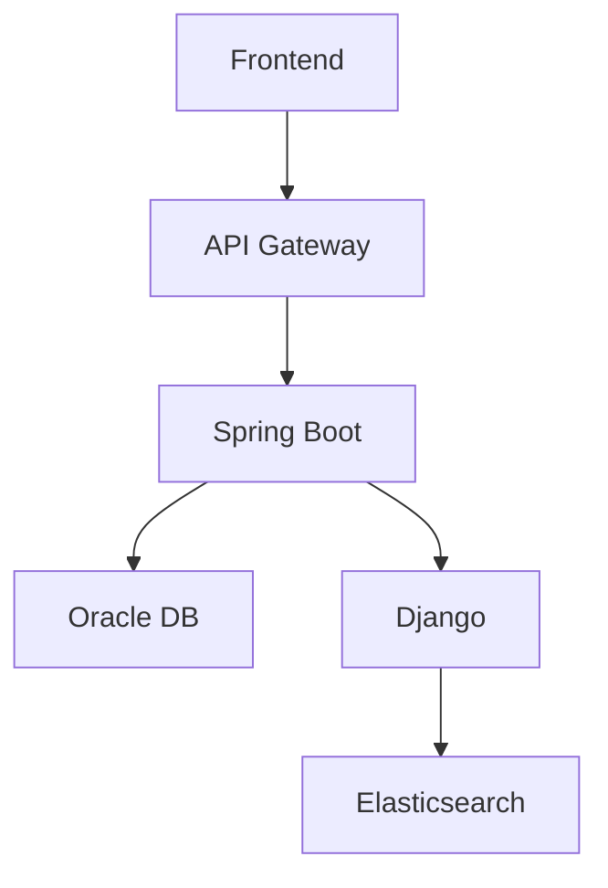

# {Feature Name} 설계 문서

## 1. 개요
- **기능명**: {feature-name}
- **계획서**: [plan.md](../01-plan/features/{feature-name}.plan.md)
- **작성일**: {YYYY-MM-DD}

## 2. 아키텍처

### 2.1 시스템 구조


### 2.2 컴포넌트 설계
| 컴포넌트 | 역할 | 기술 |
|----------|------|------|
| | | |

## 3. API 설계

### 3.1 엔드포인트
| Method | Path | 설명 |
|--------|------|------|
| GET | /api/v1/{resource} | |
| POST | /api/v1/{resource} | |

### 3.2 요청/응답 스키마
* **Spring Boot**: `Java 17 Record` 패턴 사용 권장 (Response/Request DTO 불변성 보장)
* **Django**: `Pydantic` 모델 사용 권장 (엄격한 타입 검증)

```json
// Request
{
}

// Response
{
  "code": "SUCCESS",
  "data": {}
}
```

## 4. 데이터베이스 설계

### 4.1 테이블
| 테이블명 | 설명 | 주요 컬럼 |
|----------|------|----------|
| | | |

### 4.2 데이터 패턴 (Data Patterns)
- **Soft Delete**: 물리 삭제 대신 `deleted_at` 컬럼 사용
- **Locking**:
    - **비관적 락 (Pessimistic)**: 금전/재고 관련 (`SELECT FOR UPDATE`)
    - **낙관적 락 (Optimistic)**: 설정/프로필 관련 (`version` 컬럼)

### 4.3 ERD
<!-- Mermaid ER 다이어그램 -->

## 5. 프론트엔드 설계

### 5.1 화면 구성
| 화면 | 경로 | 컴포넌트 |
|------|------|----------|
| | | |

### 5.2 WDS 컴포넌트 사용
- [ ] Button (variant: primary/secondary)
- [ ] Card (Glassmorphism eligible)
- [ ] Form (react-hook-form + zod)
- [ ] BottomSheet (vaul + glass effect)
- [ ] BrixBadge (variant: 3d/flat)
- [ ] Lottie Animation (--lottie)

## 6. WooriDo 도메인 규칙 적용

### 6.1 당도(Brix) 시스템
```typescript
// 적용 시
const brix = calculateBrix(paymentCount, activityScore);
// 공식: 12 + (paymentCount * 0.7) + (activityScore * 0.15)
```

### 6.2 Fintech 규칙
```java
// 트랜잭션 설정
@Transactional(isolation = Isolation.READ_COMMITTED)

// 1. 비관적 락 (Pessimistic - Money)
@Lock(LockModeType.PESSIMISTIC_WRITE)

// 2. 낙관적 락 (Optimistic - Profile)
// @Version Long version;
```

## 7. 테스트 계획
- [ ] 단위 테스트: 
- [ ] 통합 테스트: 
- [ ] E2E 테스트: 

## 8. 다음 단계
- [ ] 구현 완료 후 `/pdca-analyze {feature-name}` 실행
